This is the overall progress till now
# EchoMind — Project Progress Review
 
This is where the project stands today versus your [Scope.md](docs/Scope.md) MVP (target ~21 June 2026).
---
## High-level maturity

```mermaid
flowchart LR
    subgraph done [Working prototype]
        A[Gmail connector]
        B[File + PDF parsers]
        C[Unified pipeline.py]
        D[Chroma vector store]
        E[duoPipe RAG script]
    end
    subgraph partial [Started / stub]
        F[files.py legacy]
        G[whatsapp.py send-only]
        H[graph_rag.py empty]
    end
    subgraph missing [Not started]
        I[FastAPI backend]
        J[Frontend chat]
        K[Agents / LangGraph]
        L[Eval dashboard]
        M[Hybrid retrieval]
    end
    done --> partial
    partial --> missing
```

**Overall level:** Early **proof-of-concept** (~15–20% of full MVP).
You have a **local, script-based ingest → chunk → embed → query** loop. It is not yet a product (no API, UI, scheduling, or production hardening).
---
## What is built and working
### 1. Ingestion connectors (`backend/app/ingestion/connectors/`)
| Component | Status | Level |
|-----------|--------|--------|
| **Gmail** (`gmails.py`) | Working | OAuth, fetch recent emails, extract subject/from/date/body |
| **Files** (`files.py`) | Legacy | PyPDF + txt helpers; **not wired into pipeline**; fragile relative paths |
| **WhatsApp** (`whatsapp.py`) | Stub | **Sends** a test message only; no inbound ingestion |
### 2. Parsers (`backend/app/ingestion/parsers/`)
| Component | Status | Level |
|-----------|--------|--------|
| **email_parser.py** | Working | Normalizes Gmail output to structured dicts |
| **llama_parser.py** | Working | LlamaParse for PDFs (EU region); returns page chunks |
### 3. Unified pipeline (`pipeline.py`)
| Step | Status |
|------|--------|
| Load emails | Done — flat Chroma-safe metadata |
| Load `.txt` from `data/files/dumps/` | Done |
| Load PDFs via LlamaParse | Done |
| Chunk (500 chars, overlap 80) | Done |
| `build_index` / shared `STORE` | Partial — `STORE` defined but indexing lives in `duoPipe.py` |
This is the main architectural win: **one entry point** (`run_ingestion()` + `split_documents()`).
### 4. RAG (`backend/app/RAG/retrievers/duoPipe.py`)
| Piece | Status |
|-------|--------|
| NVIDIA embeddings | Configured |
| Groq LLM (`llama-3.3-70b-versatile`) | Configured |
| Chroma persist | `backend/data/vectorstore/` exists (indexed data on disk) |
| Retrieval chain | Script-level prototype |
**Maturity:** Runnable **CLI demo**, not a reusable `rag/index.py` service.
### 5. Data on disk
```
backend/data/
  files/dumps/ demo.txt, fastslow.pdf
  files/raw/ legacy concatenated outputs
  vectorstore/ Chroma DB (created)
```
---
## What you debugged and fixed (important learning)
| Issue | Resolution |
|-------|------------|
| LlamaParse empty JSON | EU `LLAMA_CLOUD_BASE_URL` |
| `credentials.json` path | Paths relative to connector dir |
| `ModuleNotFoundError: ingestion` | `sys.path` fix in `duoPipe.py` |
| llama-index version clash | Package upgrades |
| NVIDIA 512-token limit | Smaller chunks (`chunk_size=500`) |
| Chroma metadata dict error | Flat metadata in `load_pdf_documents` / emails |
| `{} or ()` tuple bug | `isinstance(llama_meta, dict)` check |
---
## Scope deliverables vs reality
| Deliverable (Scope.md) | Progress | Notes |
|------------------------|----------|-------|
| Ingestion pipeline (3+ sources) | **~40%** | Email + txt + PDF work; WhatsApp/audio/SMS not ingested |
| RAG pipeline | **~25%** | Vector-only script; no hybrid/graph/keyword |
| Working chat interface | **0%** | No frontend |
| FastAPI backend | **0%** | No `main.py`, `api/`, `services/` |
| Session memory / multi-turn | **0%** | Single-shot question in script |
| Agent tools (calculator, web, etc.) | **0%** | No LangGraph |
| Eval dashboard (RAGAS/DeepEval) | **0%** | `graph_rag.py` empty |
| Hybrid storage (pgvector + graph) | **0%** | Chroma only, local files |
| Finetuned models | **0%** | Not started |
| Docker / deployment | **0%** | Not started |
---
## Current architecture (as implemented)
```
[Gmail API] ──► email_parser ──┐
[.txt dumps] ─────────────────┼──► pipeline.run_ingestion()
[LlamaParse] ─► llama_parser ─┘ │
                                         ▼
                              split_documents (500/80)
                                         │
                                         ▼
                              NVIDIA Embeddings → Chroma
                                         │
                                         ▼
                              Groq LLM + retrieval chain
                                         │
                                         ▼
                              duoPipe.py (CLI answer)
```
---
## What needs modification (near term)
### A. Consolidate and clean up ingestion
| Item | Why | Future change |
|------|-----|----------------|
| **`files.py`** | Duplicates pipeline; old script style | Remove or refactor into `load_file_documents`; delete `data/files/raw/` writes |
| **`pipeline.py` imports** | `from parsers.*` needs path hacks | Add `__init__.py` + run as package, or use `ingestion.parsers.*` |
| **PDF path** | LlamaParse on every run is slow/costly | Cache parsed JSON; skip re-parse if unchanged |
| **Email HTML** | Raw HTML in chunks hurts RAG | Strip with BeautifulSoup/html2text in `load_email_documents` |
| **`parse_pdfs()` `sys.exit()`** | Kills whole pipeline on PDF failure | try/except; log and continue |
### B. Split ingest vs query in RAG
`make_retrieval_chain()` currently **re-ingests and re-embeds every run**.
**Future shape:**
```python
# ingest.py — run on schedule / manual trigger
run_ingestion() → split → embed → Chroma.persist()
# index.py — load existing store for queries
Chroma(persist_directory=STORE, embedding_function=...) → retriever
```
### C. `duoPipe.py` → proper RAG module
| Now | Target (per Scope) |
|-----|---------------------|
| Script with `sys.path` hacks | `rag/index.py` + `get_retriever()` |
| Hardcoded question | API accepts user query |
| No `filter_complex_metadata` safety | Add as backup before Chroma |
| `NVIDIAEmbeddings()` no truncate | `truncate="END"` or token-based splitter |
### D. “Latest email” type questions
Vector search ≠ chronological search. For date-sensitive queries:
- Filter/sort Gmail by `date` in metadata, or
- Use Gmail API directly for “last email”, RAG for content questions.
---
## What to build next (recommended order)
### Phase 1 — Stabilize core (1–2 weeks)
1. **`rag/index.py`** — load Chroma, expose `query(question) -> answer`
2. **`ingestion/ingest.py`** — separate one-shot indexing from querying
3. Package layout — `__init__.py`, single `STORE` path constant
4. Pin `requirements.txt` (add `chromadb`, `langchain-classic`, `langchain-text-splitters`, `beautifulsoup4`)
5. HTML email cleaning
### Phase 2 — Backend API (2–3 weeks)
1. FastAPI `main.py`
2. `POST /api/v1/ingest` — trigger pipeline (later Celery)
3. `POST /api/v1/chat` — RAG query with session id
4. `.env.example` (no secrets in repo)
### Phase 3 — UI + more sources (3–4 weeks)
1. Next.js chat UI (Scope target)
2. Wire WhatsApp **inbound** or export parser into pipeline
3. Optional: PyPDF fallback when LlamaParse unavailable
### Phase 4 — MVP polish (toward June 2026)
1. LangGraph agents + tools
2. RAGAS/DeepEval + Streamlit dashboard
3. Hybrid retrieval (BM25 + vector)
4. Postgres/pgvector or Qdrant if Chroma limits hit
5. Docker Compose
---
## Technical debt checklist
| Debt | Severity | Action |
|------|----------|--------|
| No `__init__.py` / package structure | Medium | Proper Python package under `backend/app` |
| `sys.path` hacks in `duoPipe.py` | Medium | Install editable package or always `python -m` |
| Secrets in `.env` (committed risk) | High | Ensure `.env` in `.gitignore`; add `.env.example` |
| Re-index every query | High | Split ingest/query |
| WhatsApp hardcoded phone/id | Low | Move to env vars |
| `graph_rag.py` empty | Low | Defer until basic RAG is API-backed |
| No tests | Medium | Add tests for pipeline + metadata flattening |
---
## Summary
**You have completed:** a working **local ingestion + RAG prototype** for Gmail, text files, and PDFs (LlamaParse), with chunking, NVIDIA embeddings, Chroma storage, and Groq answers via a CLI script.
**You have not yet built:** API, chat UI, agents, evals, hybrid retrieval, production deployment, or most additional data sources from the scope.
**Maturity label:** **Phase 0 → Phase 1 boundary** — proof of concept with real integrations, ready to be refactored into the structure in Scope.md (`pipeline.py` + `rag/index.py` + FastAPI).
If you want a single next step: **split ingest from query and add `rag/index.py` + a minimal FastAPI `/chat` endpoint** — that turns the script into something the rest of the MVP can plug into. Switch to **Agent mode** if you want that implemented in the repo.